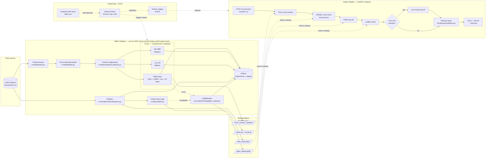

# Architecture Diagram — Churn Prevention System

## Offline + Online — combined view



## Layer responsibilities

| Layer | What it does | Where it lives |
|---|---|---|
| Raw | UK e-commerce transactions | `data/raw/online_retail_II.csv` |
| Preprocess | Drop nulls, returns, non-product codes | `src/data/loader.py` |
| Label | 90-day no-purchase = churn | `src/data/labels.py` |
| Features | RFM + behavioral + windowed + ratios | `src/features/build_features.py` |
| Churn (×3) | GBM stack, BG-NBD, CoxPH | `src/models/churn/` |
| Retrieval | SASRec → item embeddings | `src/models/retrieval/` |
| ANN | FAISS top-50 | `src/faiss/` |
| Ranking | LGBMRanker with churn × retrieval features | `src/models/ranking/` |
| Rerank (opt) | LLM (Anthropic API) | `src/models/reranker/` |
| Decision | risk tier + discount | `src/decision/` |
| API | FastAPI single endpoint | `src/api/` |
| Tracking | MLflow | `mlops/mlflow/` |
| Drift | Evidently report | `mlops/evidently/` |
| CI/CD | GH Actions (lint-test, train, drift) | `.github/workflows/` |
```
